# CSCE 435 Group project

## 0. Group number: 15

## 1. Group members:
1. Edgar Garcia-Doria
2. Abdullah Balbaid
3. Sahil Dhana
4. Andy Callahan

## 2. Project topic: Parallel sorting algorithms

### 2a. Description
Our team will communicate through Discord. We'll create dedicated channels for different aspects of the project to keep our discussions organized. Regular voice or video meetings will be scheduled to sync up on progress, address any issues, and plan next steps. By using Discord, we'll be able to share files, code snippets, and updates instantly, ensuring everyone stays on the same page throughout the project.

We will emplement:
- Bitonic Sort: A bitonic sequence is a series of elements that are monotonically increasing then decreasing. The algorithm forms a bitonic sequence from an unordered sequence starting with a size of two (default bitonic). Then, the algorithm recursively merges pairs of bitonic sequences together to sort the elements.
- Sample Sort: Sorting algorithm that is a generalization of quicksort. It divides an array into small segments then sorts each segment. Once each segment is sorted it uses “samples” from each segment to determine partition boundaries/splitters, which then distributes all the data into sorted buckets. Buckets are then sorted independently and merged to create a final sorted array, which makes it an appropriate algorithm for parallel processing.
- Merge Sort: Sorting algorithm that uses the divide-and-conquer strategy. It splits the array into smaller halves, continues to divide the halves until each subarray has only one item, and finally compares the smaller subarrays and combines their results into a sorted array.
- Radix Sort: Sorting algorithm that processes integers by individual digits. It groups numbers based on each digit, starting from the least significant digit to the most significant, and continues sorting and redistributing them accordingly. In a parallel implementation, it divides the dataset among multiple processors; each processor sorts its portion for each digit position and exchanges data based on counts, repeating this process until the entire array is sorted.

### 2b. Pseudocode for each parallel algorithm
Merge sort  
```
Function mergeSort(array a, temp array b, left, right):
    If left < right:
        mid = (left + right) / 2
        Call mergeSort(a, b, left, mid)
        Call mergeSort(a, b, mid + 1, right)
        Call merge(a, b, left, mid, right)

Function merge(array a, temp array b, left, mid, right):
    Initialize h = left, i = left, j = mid + 1
    While h <= mid and j <= right:
        If a[h] <= a[j], set b[i] = a[h] and increment h
        Else set b[i] = a[j] and increment j
        Increment i
    Copy remaining elements from a[j to right] or a[h to mid] into b[i to end]
    Copy elements from b[left to right] back to a

Main:
    Allocate original_array of size n

    Initialize MPI
    Get world_rank and world_size

    Calculate size = n / world_size (subarray size for each process)
    Allocate sub_array for each process

    Scatter original_array to all processes:
        MPI_Scatter(original_array, size, sub_array, size, 0)

    Perform mergeSort on sub_array:
        Allocate tmp_array
        Call mergeSort(sub_array, tmp_array, 0, size - 1)

    Gather sorted subarrays at rank 0:
        MPI_Gather(sub_array, size, sorted_array, size, 0)

    If world_rank == 0:
        Allocate other_array
        Call mergeSort on sorted_array to combine all parts into a final sorted array
        Print sorted array

    Free allocated memory for original_array, sub_array, tmp_array
    Finalize MPI
```
The array to be sorted is divided among multiple cores, and each core is assigned a sub-array to perform the merge sort in parallel. The process begins with the master core distributing sub-arrays to each core via MPI_Scatter. Each core independently sorts its assigned sub-array using merge sort. After sorting, the sub-arrays are gathered back to the master core using MPI_Gather, where a final merge step combines the sorted sub-arrays into a fully sorted array.

Bitonic sort  
```
Main:
  Initialize MPI 
  Get number of processes and current rank
  Create initial input array
  Scatter array in chunks to worker processes
  Call bitonic_sort on each process
  When sorting has finished gather all sub-arrays

Function bitonic_sort():
  Sequential sort the local data (quicksort)
  Let d = number of stages (log_2 (number of processors))
  for i:=0 to d - 1 do:
    for j:=i down to 0 do
      if (i+1) bit of process rank = jth bit of rank then
        comp_exchange_max(j)
      else
        comp_exchange_min(j)

Function comp_exchange_max(j)
	Paired process rank = current rank xor 1 << j
	Send elements to paired process
	Receive elements from paired process
	Merge the higher elements

Function comp_exchange_min(j)
	Paired process rank = current rank xor 1 << j
	Send elements to paired process
	Receive elements from paired process
	Merge the lower elements
```


Radix Sort
```
ParallelRadixSort(arr):
    if length(arr) <= 1:
        return arr

    max_digit = number of bits in the largest number in arr
    
    // Master Processor
    for d = max_digit-1 down to 0 do:
        // Broadcast the current digit position `d` to all processors

        // Split the array among worker processors
        // Each processor computes which numbers have `0` at digit `d`
        places = Map each element in arr to True if bit `d` is 0, otherwise False

        // Initialize two lists, stack (for 0s) and remaining (for 1s)
        stack = empty list
        remaining = empty list

        // Each processor classifies its part of arr based on places
        for each index idx in places:
            if places[idx] == True:
                Add arr[idx] to stack
            else:
                Add arr[idx] to remaining
        
        // Combine results from all processors (gather stack and remaining)
        arr = stack concatenated with remaining

    return arr
```

This parallel radix sort algorithm sorts an array by processing it bit by bit, starting from the least significant bit. It uses multiple processors to speed up the sorting. First, it identifies the largest number in the array to determine the maximum number of bits needed for comparison. The master processor broadcasts the current bit position (digit) to all worker processors, which then divide the array for parallel processing.

Each processor checks its portion of the array, mapping whether each element has a 0 or 1 at the current bit. Numbers with a 0 are placed in one list (stack of zeros), while those with a 1 go into another (remaining of ones). After this classification, results from all processors are gathered, and the array is updated by combining the lists. This process is repeated for each bit until the array is sorted. The parallelization allows the algorithm to handle large datasets efficiently.


Radix Sort github: https://github.com/naps62/parallel-sort/blob/master/src/radix.mpi.cpp
```
ParallelRadixSort(arr, id, num_processes, num_bits_per_pass):
    # Initialize constants
    num_buckets = 2^num_bits_per_pass  # total number of buckets
    buckets_per_processor = num_buckets / num_processes  # number of buckets each processor handles
    mask = (1 << num_bits_per_pass) - 1  # mask for extracting key bits

    # Initialize data structures for buckets and counts
    buckets = array of empty lists, size num_buckets
    bucket_counts = 2D array to track count of elements per bucket and processor
    bucket_accum = 2D array to track positions for placing elements in the final sorted array
    bucket_sizes = array for storing bucket sizes per processor

    # Main loop for sorting based on each set of bits
    while mask != 0:
        # Reset bucket counts and clear buckets
        Reset bucket counts and empty buckets

        # Distribute elements into buckets based on the current bits (using mask)
        for each element in arr:
            determine the appropriate bucket for the element
            add element to the bucket
            update bucket count

        # Share and combine bucket counts across all processes

        # Calculate positions (bucket_accum) for each element in the final sorted array

        # Send bucket elements to corresponding processors based on bucket allocation

        # Receive elements from other processors and place them in the correct positions

        # Update the array for the next pass
        arr = combined data from all buckets for this processor
        shift the mask to process the next set of bits

    return arr
```


Sample Sort
```
function Sample_Sort(arr[1..n], num_buckets, p):
        1. Initialize MPI
        - MPI.Init()
        - Get rank of the current process and num_processes
        - Get the segment size -> segment_size = n / num_processes


        2. Scatter the array A across all processes
        - local_segment = MPI_Scatter(A, segment_size, root=0)
        - Processes now have a portion of arr('local_segment')


        3. Sort the local segment using a appropriate sorting algorithm 
        - Sort local_segment


        4. Select S samples from local segments
        - samples_local = []
        - Randomly select '(p−1) * num_buckets' elements from local_segment as samples
        - samples_all = MPI_Gather(samples_local, root=0) - gathers all samples at root processes


        5. Root process sorts samples and selects splitters
        - if rank == 0:
            - Sort 'samples_all' using a appropriate sorting algorithm 
            - Determine splitters: [s0, s1, ..., sp] <- [-∞, Sk, S2k, ..., S(p−1)k, ∞]
        - splitters = MPI_Bcast(splitters, root=0) - Broadcasting splitters to all processes


        6. Partition elements into buckets based on splitters
        - Initialize local_buckets = [] * num_buckets
        - for each a in local_segment:
            - Find j such that splitters[j-1] < a <= splitters[j]
            - Place a in local_buckets[j]


        7. Redistribute buckets among processes
        - Prepare 'send_counts' and 'send_displacements' for 'local_buckets'
        - Use MPI_Alltoallv to exchange elements such that each process receives a global bucket
        - Each process now holds one bucket (global_bucket) which contains all elements within a specific range


        8. Sort each bucket locally
        - Sort global_bucket using a appropriate sorting algorithm 


        9. Gather sorted buckets at the root process
        - sorted_buckets_all = MPI_Gather(global_bucket, root=0)


        10. Root process concatenates sorted buckets to form the final sorted array
        - if rank == 0:
            - final_sorted_array = concatenate(sorted_buckets_all)
            - return final_sorted_array


        11. Finalize MPI environment
        - MPI_Finalize()
```


### 2c. Evaluation plan - what and how will you measure and compare

- **Input sizes, Input types**

We'll test the algorithm with various input sizes to evaluate its performance on small and large datasets. The input types will include random integers, sorted arrays, and reverse-sorted arrays to see how the algorithm handles different data scenarios. Various input sizes would include powers of two which would be 2^16, 2^18, 2^20, 2^22, 2^24, 2^26, 2^28 to understand the scalability of the algorithms.

- **Strong scaling**

We'll measure how the execution time changes when we increase the number of processors while keeping the problem size the same. This will show us how efficiently the algorithm scales with more processors. MPI processes for the identical inputs would include 2, 4, 8, 16, 32, 64, 128, 256, 512, 1024 to measure execution times. While doing this we would also test various inputs sizes as mentioned above.

- **Weak scaling**

We'll assess performance by increasing both the problem size and the number of processors proportionally. This will help us understand how well the algorithm maintains efficiency as workload and resources grow. Also, this would help us see how the algorithms handle large data.


## 3. Project Results

Please note that the results may not be fully comprehensive due to the long queue in Grace. However, we have made every effort to include as much data as possible to evaluate the performance.

### Merge Sort

Merging refers to comp and Gather / Scatter refer to comm, these can be renamed in future submissions once Grace is up.\
#### **Random Arrays**


Here we can see that the average time for each thread for whole function goes down. This can be explained since each worker thread has less computation to do, which goes hand in hand with the merging graph, which also goes down as the number of processors goes up. The array creation time should be the same since there is only one process doing the creation. MPI Scatter seems to follow a downwards - trend, this could be explained by the time required to send smaller chunks of data is generally lower than sending larger chunks, which can reduce the overall communication time. The whole function max time, which is held by the master process staying nearly the same is due to the master process having to perform a final merge sort call with the chunk sorted array at the end. However, the max time of merging is downwards because workers have a smaller chunk to compute as the processor count goes up and is divided amongst more processors. 

#### **Sorted Arrays**
In order: Avg - Whole Function, Array Creation, MPI Scatter, Merging, MPI Gather, Sort Validation, Max - Whole Function, Merging


The sorted array follows the same trends as the random array. 

#### **Reverse Sorted Arrays**
In order: Avg - Whole Function, Array Creation, MPI Scatter, Merging, MPI Gather, Sort Validation, Max - Whole Function, Merging


The reverse sorted array follows the same trends as the random array. 


#### **1% Perturbed Arrays**
In order: Avg - Whole Function, Array Creation, MPI Scatter, Merging, MPI Gather, Sort Validation, Max - Whole Function, Merging
Not able to submit yet since grace is not processing any jobs at the time of report submission. 

### Bitonic Sort

#### **Sorted Arrays**
Bitonic is an unstable algorithm which means it reorders the elements in the array even if they are already sorted. The sorting time decreases for each input size and the largest array had the greatest speedup. Computation dominates the overall runtime which includes local sequential sort and merging. As parallelization increases, each thread operates on a smaller portion of data.  
  


#### **Reverse Sorted Arrays**
The reverse sorted arrays have similar runtimes to the sorted arrays.  
  


#### **Random Input Arrays**
The random input arrays took the most amount of time compared to the different inputs. More time is needed on local sequential sort since not enough threads are available to utilize the parallel nature of bitonic sort. As the number of threads increase, each input size converges to a low runtime. Communication remains relatively constant and accounts for a small portion of the overall runtime.   
  


#### **1% Perturbed Arrays**
The 1% perturbed arrays show similar trends compared to the other inputs. As the parallelization increases each input type and array size converges to similar runtimes. Increasing the number of threads past a 2^9 will not improve runtime significantly since parallelization overhead will become dominant.  
  


### Radix Sort
We couldn't run tests with 1024 processors because Grace had a proxy error. Plus, the queue was really long, so we were only able to test with random input arrays, reversed arrays, and mostly sorted ones. To keep things simple, we focused on the most important plots and based our observations on those.

#### **Random Input Arrays**
The plots show that parallel radix sort works well, especially with larger arrays. But for smaller ones, communication slows things down.

##### **Array Creation**
- **Max**: The maximum time to create random arrays stayed about the same, no matter how many processors we used.

    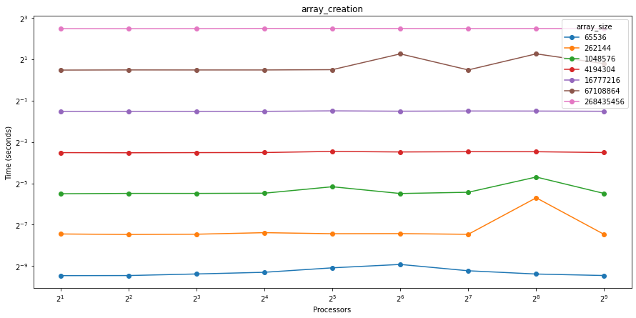
    

##### **Master Function**
  
- **Max**: The max execution time for the master function went down as we added more processors for bigger arrays, but smaller arrays showed some ups and downs.

    - **Log Scale**:

    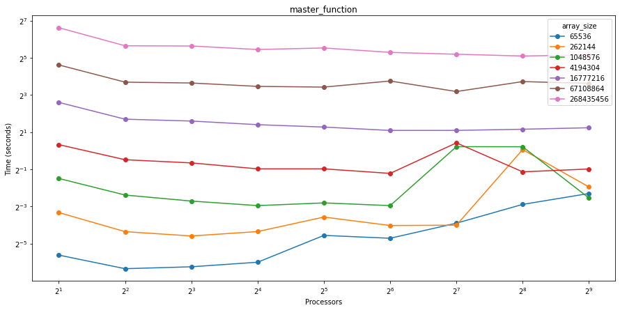

    - **Regular Scale**:

    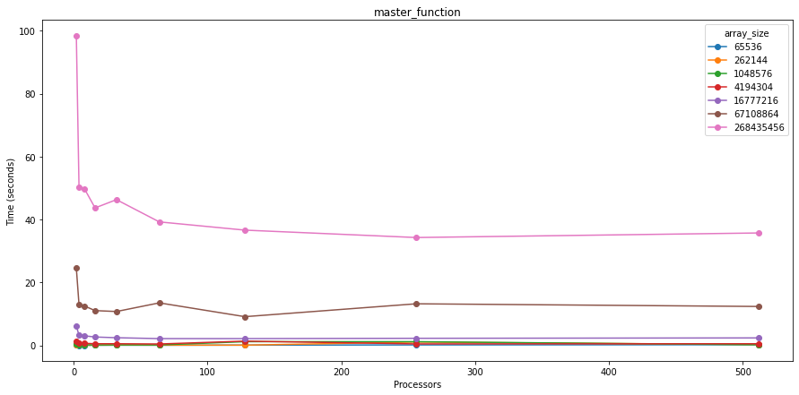
  

##### **Sort Validation**

- **Max**: The time it took to validate the sorted arrays stayed consistent as the processor count went up.

    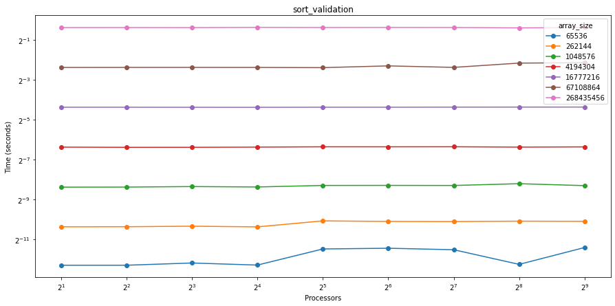

##### **Whole Function**
The whole function performed better as more processors were added, particularly with bigger arrays.
  
- **Max**: The max execution time was highest with the biggest arrays and fewer processors, but after a certain point, adding more processors didn't help much.

    - **Log Scale**:

    

    - **Regular Scale**:

    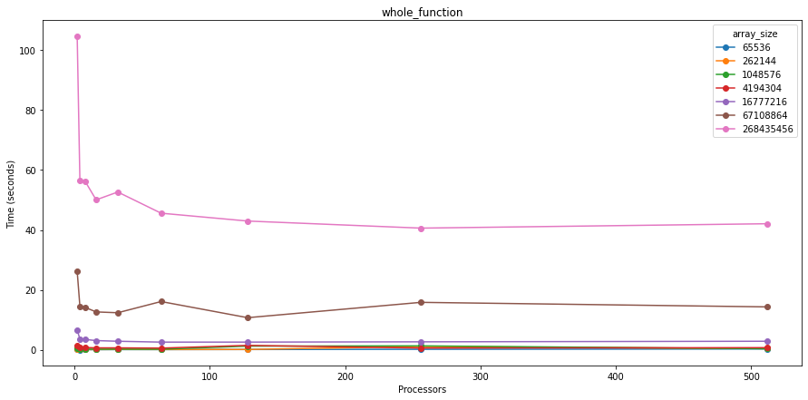
  

##### **Worker Function**
The worker function, which does most of the distributed work, scaled reasonably well with more processors.
  
- **Max**: The time for worker function execution dropped noticeably with more processors for bigger arrays. Smaller arrays, though, didn’t benefit as much because of the communication overhead.

    - **Log Scale**:

    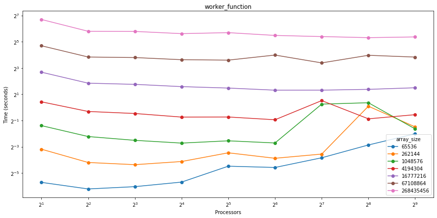

    - **Regular Scale**:

    
  
#### **Reversed Input Arrays**

##### **Array Creation**
- **Max**: Similar to random arrays, the time to create reversed arrays didn’t change much with more processors.
    
    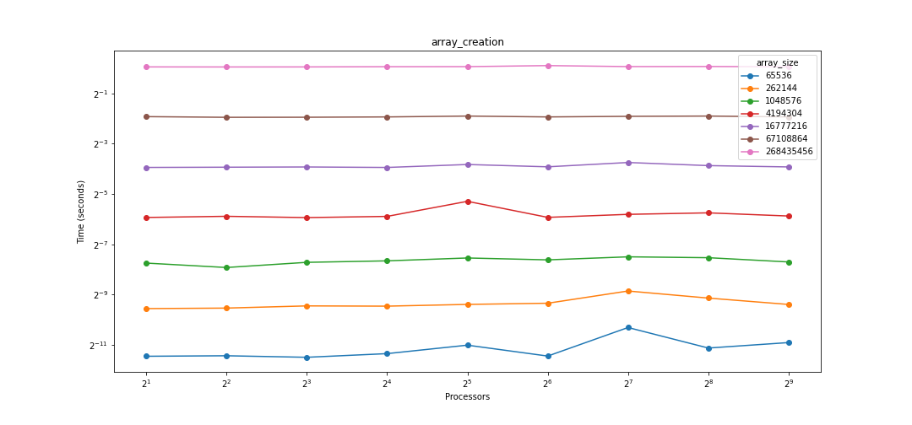
    

##### **Master Function**
  
- **Max**: The master function’s max time decreased as we added more processors, especially for large arrays, though there were some inconsistencies with smaller arrays.

    - **Log Scale**:

    

    - **Regular Scale**:

    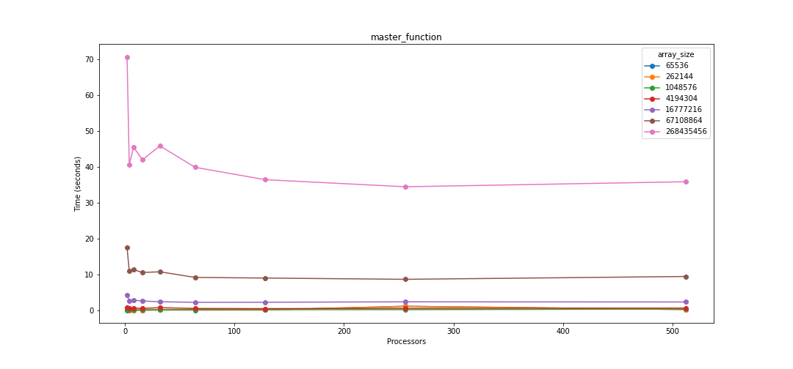
  

##### **Sort Validation**

- **Max**: The validation time stayed flat as processor counts increased.

    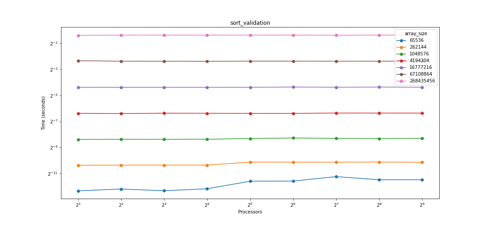

##### **Whole Function**
The whole function showed better performance with more processors, especially for large arrays.
  
- **Max**: We saw the longest execution times with the biggest arrays and fewer processors, with smaller improvements after a certain point.

    - **Log Scale**:

    

    - **Regular Scale**:

    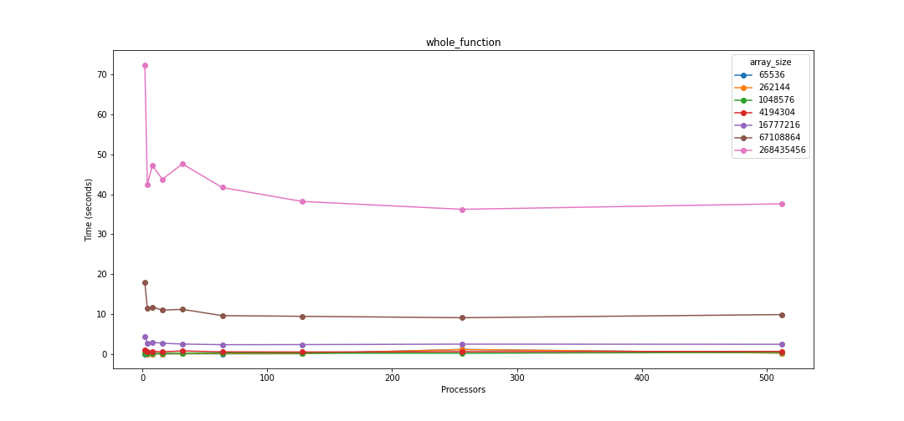
  

##### **Worker Function**
The worker function scaled well with more processors.
  
- **Max**: Worker function execution times dropped a lot with larger arrays and more processors, but for smaller arrays, the improvement was limited due to communication delays.

    - **Log Scale**:

    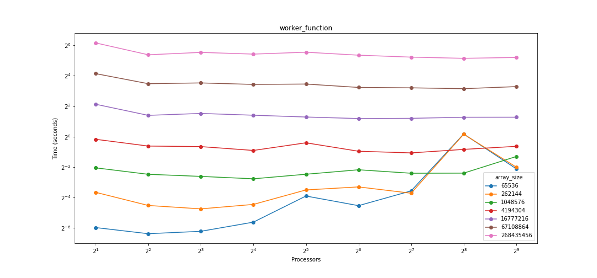

    - **Regular Scale**:

    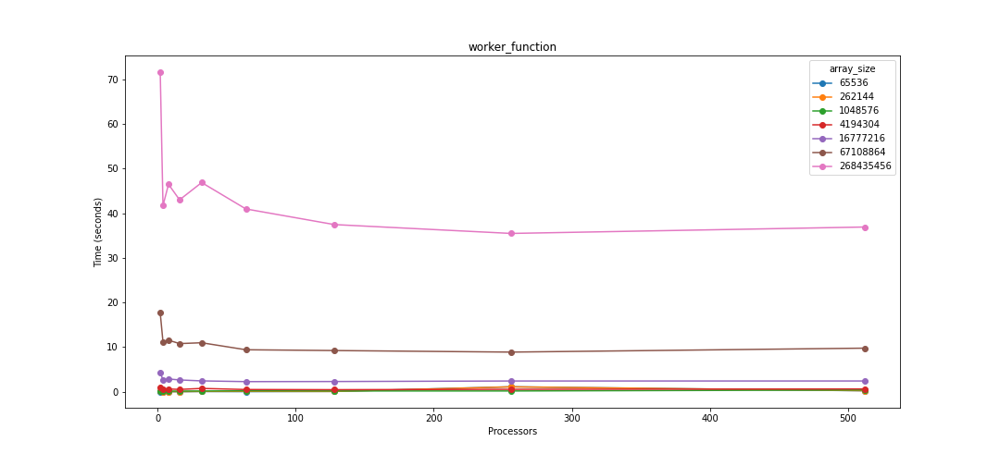

#### **Sorted Input Arrays**
Since the algorithm doesn’t check if the array is already sorted, the performance was similar to the other input types.

##### **Array Creation**
- **Max**: The time for creating sorted arrays stayed constant as the processor count increased.
    
    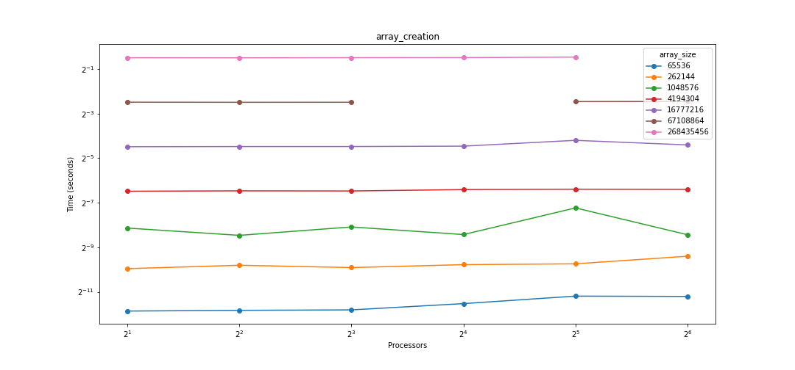
    

##### **Master Function**
  
- **Max**: For large arrays, the max time for the master function decreased as more processors were added, with some fluctuations for smaller arrays.

    - **Log Scale**:

    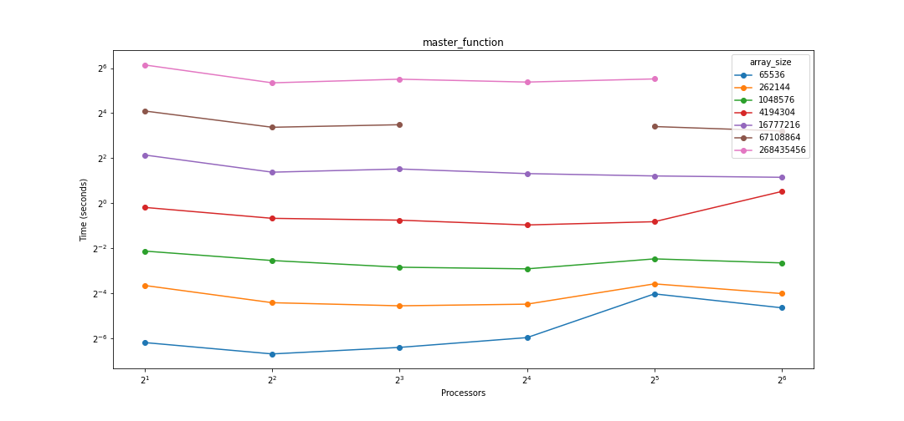

    - **Regular Scale**:

    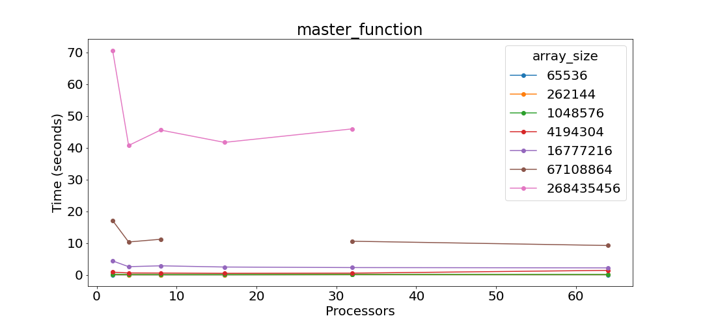
  

##### **Sort Validation**

- **Max**: Sort validation times remained flat as we added more processors.

    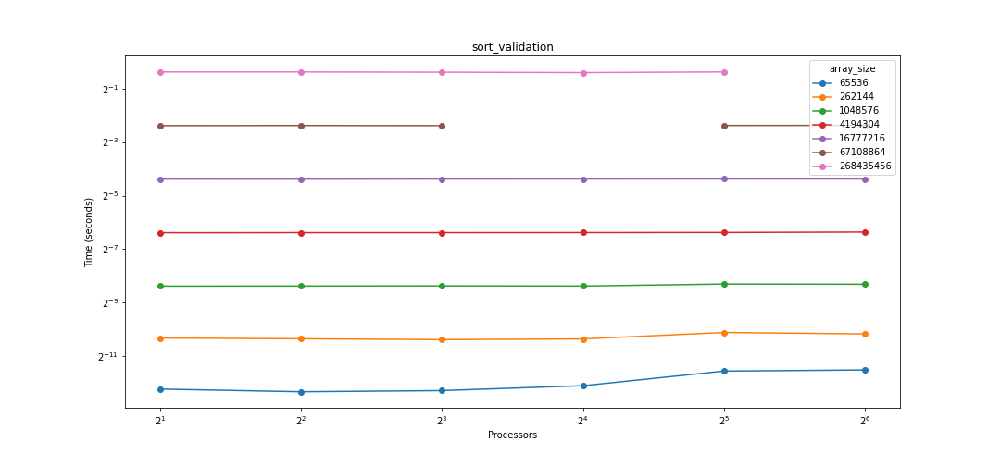

##### **Whole Function**
Adding processors improved the whole function’s performance, particularly with larger arrays.
  
- **Max**: The largest arrays had the longest execution times with fewer processors, with only small improvements beyond a certain point.

    - **Log Scale**:

    

    - **Regular Scale**:

    
  

##### **Worker Function**
The worker function scaled well with more processors.
  
- **Max**: Execution times decreased significantly with larger arrays and more processors, but smaller arrays didn’t benefit as much due to communication overhead.

    - **Log Scale**:

    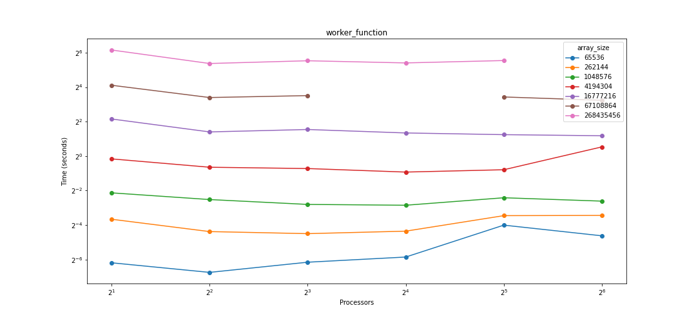

    - **Regular Scale**:

    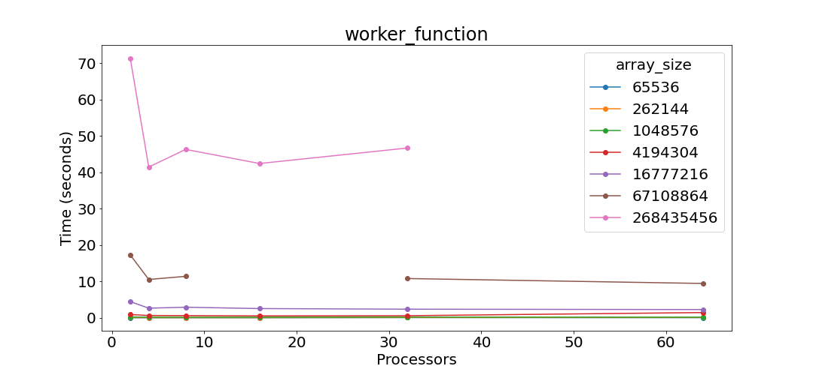

#### **1% Perturbed Arrays**
TBD


### Sample Sort

This is a detailed analysis of computation performance and communication performance along with figures and explanations of the analysis.


Note*** When looking at min time and max times of the graphs for average time/rank we can see that the minimum time would provide us with the baseline for the fastest possible communication time and the maximum time would provide us with the highest time, which could highlight any bottlenecks. 


**Sorted**


Avg time/rank - main


We can see that the average time for the sample sort implementation for sorted arrays seems to go down for larger array sizes and go up for smaller array sizes. Time spent on tasks such as communication seems to be increasing the average time for smaller arrays and decreasing the average ‘main’ time for larger arrays. There is also not a great distribution of data with regards to smaller arrays as there is with larger arrays. Sorted arrays also seem to have less balanced input which could also slow down ‘main’ times.


Avg time/rank - comp


The average computation times for ‘main’ seem to be going down for each array size except for smaller arrays that increase processors. This is likely due to overhead that is associated with increasing processors while the array is small, which negatively impacts this algorithm. Data is not distributed as efficiently as it could be. There is more time being spent communicating rather than actually sorting. 


Total time, Sorted - comm


As processors increase the communication time also increases. The more processors you have means that you generally have more communication going on between the processors.


**Random** 


Avg. time/rank - main


The average ‘main’ times for random arrays tend to go down except for smaller arrays. As said previously smaller arrays have seemed to be spending more time communicating as processors increase rather than sorting. Showing that communication is more dominant over computation. 


Avg. time/rank - comp


Average computation times are very similar to that of the sorted arrays. **explanation is given under sorted array graph


Total Time, Random - comm


Total communication times are very similar to that of sorted arrays.  **explanation is given under sorted array graph


**Reverse sorted**


Avg time/rank - main


Average ‘main’ times for reverse sorted are very similar to that of sorted arrays.  **explanation is given under sorted array graph


Avg time/rank - comp


Average ‘comp’ times for reverse sorted are very similar to that of sorted arrays.  **explanation is given under sorted input type ‘comp’ graph.


Total time, Reverse Sorted - comm


Total ‘comm’ times for reverse sorted input type is very similar to that of the sorted input type ‘comm’.  **explanation is given under sorted input type ‘comm’ graph.


**1% Perturbed**


Avg. time/rank - main


Average ‘main’ times for 1% perturbed are very similar to that of random arrays.  **explanation is given under random input graph


Avg time/rank - comp


Average ‘comp’ times for 1% perturbed are very similar to that of random arrays.  **explanation is given under random input type ‘comp’ graph.


Total time, 1% Perturbed - comm


Total communication times are very similar to that of sorted arrays.  **explanation is given under sorted array graph


**Something to note:**
Avg. time/rank, random - comm


These are the total times for average communication times for random input size. Communication seems to be going down for larger arrays and up for smaller arrays. It seems that since there are more processors for larger arrays there is a smaller portion of data that is being sorted which creates fast communication times since sorting is done fairly quickly. We see almost the opposite happen for smaller arrays. More communication is happening because there is more data.


Avg rank/time, 1% perturbed - comm


Similar trend to that of the random input arrays. **explanation is above under the random input graph.


Avg rank/time, sorted - comm


In the sorted input type graph we see that instead of going down as we saw in the random input type it stays fairly constant. This could be due to the input type being less balanced in terms of the array itself for each processor. Leading to inefficient sorting for each processor.


Avg rank/time, reverse sorted - comm


Similar trend to that of the sorted input array. **explanation is above under the sorted input graph.


**Presentation:**


Main - Speedup, Random


As you can see there is an overhead for smaller arrays as you increase processors. Time spent on communication and managing parallel tasks take a large portion of time which limits speedup. As for larger arrays, we see a benefit in dividing the workload as you increase the number of processors. 


Main - Avg Time per Rank (Array size: 2^ 28)


Average time for ‘main’ decreases on varying input types. Random and perturbed are the ones on the faster end. This is probably due to the input types being more balanced for each processor for random and perturbed. Leading to inefficient sorting for each processor. Another possibility is how the inputs are sorted. This could also lead to some overhead. 


Total Time, Random - comm


As the number of processors increases, the longer it takes for communication between each process. Since there are more processors there is more communication that is taking place. As processes increase at the end it starts to level off. The leveling off could potentially be due to MPI’s implementation with high processor counts. Meaning that MPI is able to handle these processors when there are too many. 
